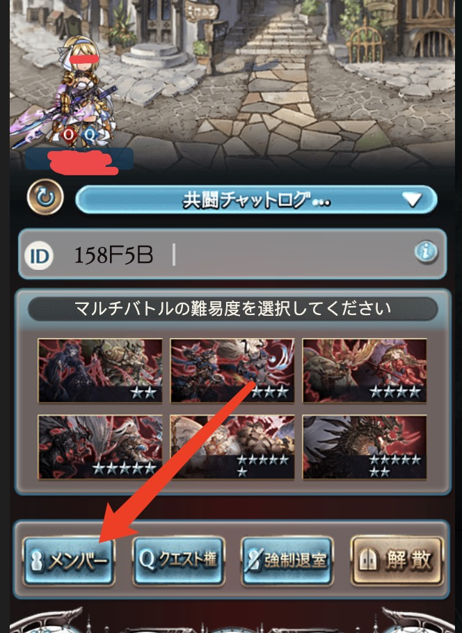
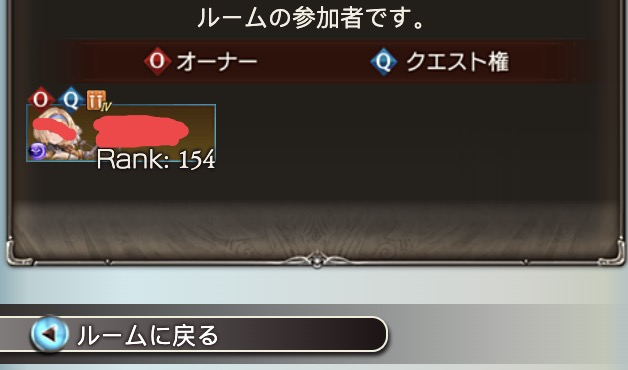
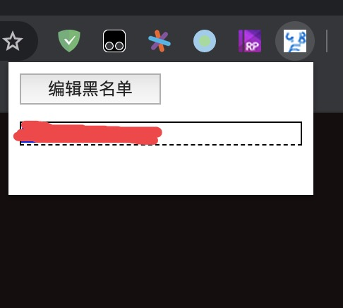
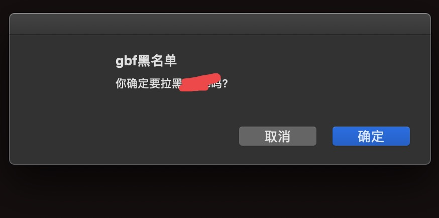
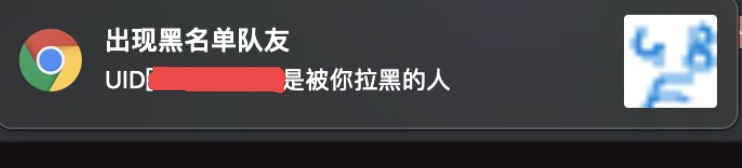
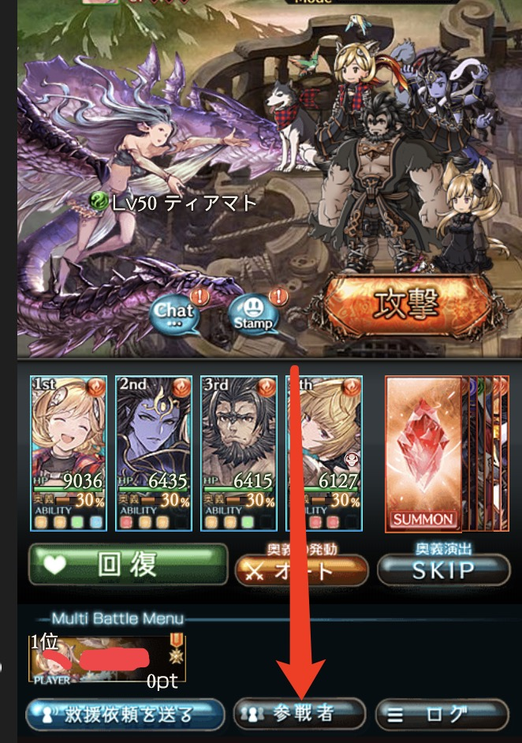
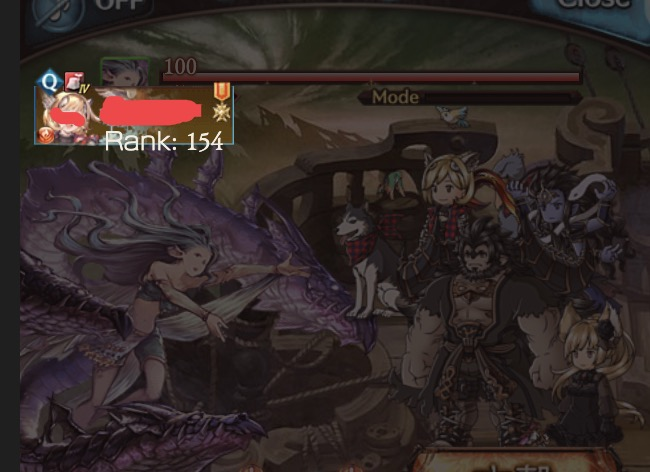

# gbf黑名单插件

不保证不会被封号。不保证不会被封号。不保证不会被封号。

### 使用

#### 共斗
进入房间后点击参与者按钮即可进入参与者界面

此时点击插件图标就可以查看所有玩家信息。

点击对应的玩家就可以将其拉入黑名单中。

##### 黑名单玩家提醒

依旧是点击参与者按钮

点击后需要等待1.5秒才会提醒这些玩家中是否有黑名单玩家

#### 救援

进入房间后也是点击参与者按钮

进入该页面后点击插件图标就能看到所有玩家并拉黑

同时如果出现黑名单中的玩家也会立即提醒。
